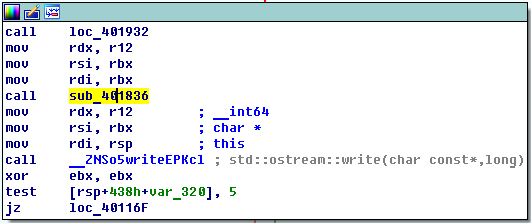
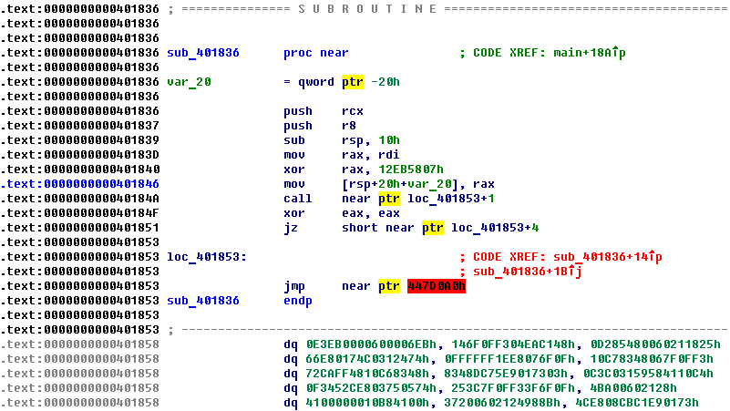
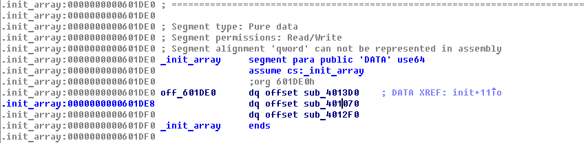
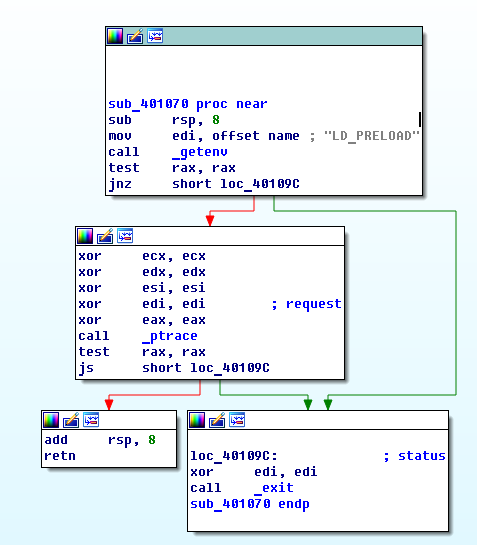
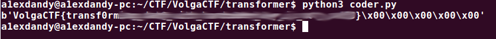

VolgaCTF 2016 Quals
===================
Transformer (Reverse, 400)
--------------------------

> This binary does something with the data. The transformation must be reversible,
but the details are unknown. It shouldn't be too difficult to reverse that transformation
and obtain the flag, should it?
>
> [transformer](https://2016.volgactf.ru/files/reverse_transformer/transformer)
> [flag.transformed](https://2016.volgactf.ru/files/reverse_transformer/flag.transformed)


Даны два файла: **transformer** - x64 ELF и **flag.transformed** - бинарный файл,
результат работы программы.

При запуске программы без параметров выдается help.
```
a1exdandy@a1exdandy-pc:~/CTF/VolgaCTF/transformer$ ./transformer
usage:
	transformer <in file> <out file>
		<in file>   file to transform
		<out file>  output file

```
Попробуем подать на вход программе какой-нибудь файл.
```
a1exdandy@a1exdandy-pc:~/CTF/VolgaCTF/transformer$ echo 01234567890123456789 > in
a1exdandy@a1exdandy-pc:~/CTF/VolgaCTF/transformer$ ./transformer in out
a1exdandy@a1exdandy-pc:~/CTF/VolgaCTF/transformer$ hd in
00000000  30 31 32 33 34 35 36 37  38 39 30 31 32 33 34 35  |0123456789012345|
00000010  36 37 38 39 0a                                    |6789.|
00000015
a1exdandy@a1exdandy-pc:~/CTF/VolgaCTF/transformer$ hd out
00000000  43 8e 55 44 c2 b8 af 44  b0 17 bb a2 77 12 5b 39  |C.UD...D....w.[9|
00000010  ce e9 4b 78 ac a0 56 be  34 87 43 f5 f3 2f 69 1e  |..Kx..V.4.C../i.|
00000020

```
Заметим, что входные данные выравниваются до 16 байт, и если попробовать изменить
один 16-байтовый блок входных данных, то это никак не повлияет на результат в других блоках.


Перейдем непосредственно к реверсу и откроем программу в IDA. В `main` достаточно
много кода, но он очевидный - в нем происходят различные проверки аргументов,
вывод спарвки, открытие/чтение/запись файлов. Наибольший интерес вызывает участок кода между чтением и записью.



Сразу привлекает внимаение функция `sub_401836`. К сожалению, IDA не может правильно
анализировать код этой функции. Так как он достаточно запутанный, наблюдается много
переходов в середины инструкций. Ручная конвертация данных в код заняла бы достаточно
много времени. Воспользуемся отладчиком `gdb`, чтобы трассировать процесс выполнения этой
функции.



Тут нас поджидает первая проблема: программа отказывается работать под отладчиком,
завершаясь еще до входа в `main`. Вернемся в IDA и попытаемся понять, почему так
происходит. Посмотрев секцию `.init_array` увидим в ней три функции.




Вторая функция является очень любопытной. Сначала в ней проверяется наличие
переменной среды `LD_PRELOAD`, которая может быть использована для подключения
произвольных библиотек к программе (это позволило бы исполнять произвольный код
до исполнения самой программы). Затем происходит вызов `ptrace(PTRACE_TRACEME, 0, 0, 0)`,
который позволяет определить, отлаживается ли процесс в данный момент. Попробуем
заменить соответствующие условные переходы на `nop` (с помощью hex-редактора или
прямо в IDA), и запустим пропатченную версию программы.

```
a1exdandy@a1exdandy-pc:~/CTF/VolgaCTF/transformer$ gdb ./transformer
GNU gdb (Ubuntu 7.7.1-0ubuntu5~14.04.2) 7.7.1
(gdb) r
Starting program: /home/a1exdandy/CTF/VolgaCTF/transformer/transformer
usage:
	transformer <in file> <out file>
		<in file>   file to transform
		<out file>  output file
[Inferior 1 (process 8043) exited with code 01]
(gdb) !rm out
(gdb) r in out
Starting program: /home/a1exdandy/CTF/VolgaCTF/transformer/transformer in out
[Inferior 1 (process 8048) exited normally]
(gdb) !hd out
00000000  43 8e 55 44 c2 b8 af 44  b0 17 bb a2 77 12 5b 39  |C.UD...D....w.[9|
00000010  ce e9 4b 78 ac a0 56 be  34 87 43 f5 f3 2f 69 1e  |..Kx..V.4.C../i.|
00000020
(gdb)
```

Всё отлично работает, вывод от нашего тестового файла не изменился. Для трассировки
я воспользовался следующим скриптом:

```shell
#!/bin/sh

gdb ./transformer <<EOF
    break *0x401836
    run in out
    while 1
        si
    end
EOF
```

Скрипт запускает программу на тестовых данных, доходит до функции, которую мы хотим
трассировать, и начинает её пошаговое выполнение. Чтобы в выводе была полезная для нас
информация, необходимо выполнить `set disassemble-next-line on`; у меня эта настройка
прописана в `~/.gdbinit`.

Запустим скрипт и обработаем его вывод:

```
a1exdandy@a1exdandy-pc:~/CTF/VolgaCTF/transformer$ ./trace.sh > trace.raw
a1exdandy@a1exdandy-pc:~/CTF/VolgaCTF/transformer$ cat trace.raw | grep "=> 0x00000000004" | cut -f1,3 | sort | uniq > trace.log
```

Данным конвеером команд мы оставили только строчки из нашей программы (исключив
исполнение библиотечных функций), убрали информацию о байт-кодах инструкций,
отсортировали вывод по адресу и убрали повторяющиеся строчки. В итоге было
полученно около 200 строк кода. Ниже приведён фрагмент кода функции, которую
мы исследуем:

```
=> 0x0000000000401836:	push   rcx
=> 0x0000000000401837:	push   r8
=> 0x0000000000401839:	sub    rsp,0x10
=> 0x000000000040183d:	mov    rax,rdi
=> 0x0000000000401840:	xor    rax,0x12eb5807
=> 0x0000000000401843:	pop    rax
=> 0x0000000000401844:	jmp    0x401858
=> 0x0000000000401846:	mov    QWORD PTR [rsp],rax
=> 0x000000000040184a:	call   0x401854
=> 0x0000000000401854:	movabs rax,0x600006eb0407
=> 0x0000000000401858:	jmp    0x401860
=> 0x000000000040185e:	jmp    0x401843
=> 0x0000000000401860:	shr    rdx,0x4
=> 0x0000000000401864:	movdqu xmm2,XMMWORD PTR ds:0x602118
=> 0x000000000040186d:	test   rdx,rdx
=> 0x0000000000401870:	je     0x401896
=> 0x0000000000401872:	xor    eax,eax
=> 0x0000000000401874:	je     0x401877
=> 0x0000000000401877:	movdqa xmm0,XMMWORD PTR [rdi]
=> 0x000000000040187b:	call   0x40179e
=> 0x0000000000401880:	movdqu XMMWORD PTR [rsi],xmm0
=> 0x0000000000401884:	add    rdi,0x10
=> 0x0000000000401888:	add    rsi,0x10
=> 0x000000000040188c:	dec    rdx
=> 0x000000000040188f:	jb     0x401894
=> 0x0000000000401891:	jae    0x401894
=> 0x0000000000401894:	jne    0x401872
=> 0x0000000000401896:	add    rsp,0x10
=> 0x000000000040189a:	pop    r8
=> 0x000000000040189c:	pop    rcx
=> 0x000000000040189d:	xor    eax,eax
=> 0x000000000040189f:	ret    
```

В коде остались некоторые ненужные строки, которые можно смело убирать. Из полезного
кода сразу замечаем следующее:

```
=> 0x0000000000401877:	movdqa xmm0,XMMWORD PTR [rdi]
=> 0x000000000040187b:	call   0x40179e
=> 0x0000000000401880:	movdqu XMMWORD PTR [rsi],xmm0
```

Под дебагером можно проверить, что в первой строке в регистр `xmm0` загружаются
блоки входных данных. Во второй строке вызывается функция, которая трансформирует
блок, в третей - в `xmm0` уже лежат закодированные данные. Посмотрим функцию по
адресу `0x40179e`

```
=> 0x000000000040179e:	push   rbx
=> 0x000000000040179f:	push   rcx
=> 0x00000000004017a0:	push   rdx
=> 0x00000000004017a1:	push   rdi
=> 0x00000000004017a2:	push   r8
=> 0x00000000004017a4:	push   r9
=> 0x00000000004017a6:	push   r10
=> 0x00000000004017a8:	push   r11
=> 0x00000000004017aa:	push   r12
=> 0x00000000004017ac:	movdqa xmm7,xmm0
=> 0x00000000004017b0:	call   0x4017bb
=> 0x00000000004017bb:	mov    rax,QWORD PTR [rsp]
=> 0x00000000004017bf:	add    rax,0x13
=> 0x00000000004017c3:	mov    QWORD PTR [rsp],rax
=> 0x00000000004017c7:	ret    
=> 0x00000000004017c8:	movdqu xmm0,XMMWORD PTR ds:0x602128
=> 0x00000000004017d1:	call   0x401794
=> 0x00000000004017d6:	mov    r15d,0x10
=> 0x00000000004017dc:	jb     0x4017e1
=> 0x00000000004017de:	jae    0x4017e1
=> 0x00000000004017e1:	call   0x4015d0
=> 0x00000000004017e6:	call   0x40167d
=> 0x00000000004017eb:	call   0x40169f
=> 0x00000000004017f0:	movdqu xmm0,XMMWORD PTR [r15+0x602128]
=> 0x00000000004017f9:	call   0x401794
=> 0x00000000004017fe:	add    r15d,0x10
=> 0x0000000000401802:	cmp    r15d,0xa0
=> 0x0000000000401809:	jl     0x4017dc
=> 0x000000000040180b:	call   0x4015d0
=> 0x0000000000401810:	call   0x40167d
=> 0x0000000000401815:	movdqu xmm0,XMMWORD PTR [r15+0x602128]
=> 0x000000000040181e:	call   0x401794
=> 0x0000000000401823:	movdqa xmm0,xmm7
=> 0x0000000000401827:	pop    r12
=> 0x0000000000401829:	pop    r11
=> 0x000000000040182b:	pop    r10
=> 0x000000000040182d:	pop    r9
=> 0x000000000040182f:	pop    r8
=> 0x0000000000401831:	pop    rdi
=> 0x0000000000401832:	pop    rdx
=> 0x0000000000401833:	pop    rcx
=> 0x0000000000401834:	pop    rbx
=> 0x0000000000401835:	ret  
```

Снова замечаем блоки следующего вида:

```
=> 0x00000000004017b0:	call   0x4017bb
=> 0x00000000004017bb:	mov    rax,QWORD PTR [rsp]
=> 0x00000000004017bf:	add    rax,0x13
=> 0x00000000004017c3:	mov    QWORD PTR [rsp],rax
=> 0x00000000004017c7:	ret
```

Очевидно, что такими блоками (а их будет несколько) можно пренебречь и убрать их из трейса.
Из кода видно, что к блоку, в цикле, 10 раз применяются какие-то преобразования
(функции 0x4015d0, 0x40167d, 0x40169f) и XOR со значениями из массива. Коротко
рассмотрим каждую функцию.

```
=> 0x00000000004015d0:	jb     0x4015d5
=> 0x00000000004015d2:	jae    0x4015d5
=> 0x00000000004015d5:	sub    rsp,0x10
=> 0x00000000004015d9:	movdqu XMMWORD PTR [rsp],xmm7
=> 0x00000000004015de:	mov    ebx,DWORD PTR [rsp]
=> 0x00000000004015e1:	call   0x40161f
=> 0x00000000004015e6:	mov    DWORD PTR [rsp],eax
=> 0x00000000004015e9:	mov    ebx,DWORD PTR [rsp+0x4]
=> 0x00000000004015ed:	call   0x40161f
=> 0x00000000004015f2:	mov    DWORD PTR [rsp+0x4],eax
=> 0x00000000004015f6:	mov    ebx,DWORD PTR [rsp+0x8]
=> 0x00000000004015fa:	call   0x40161f
=> 0x00000000004015ff:	mov    DWORD PTR [rsp+0x8],eax
=> 0x0000000000401603:	mov    ebx,DWORD PTR [rsp+0xc]
=> 0x0000000000401607:	call   0x40161f
=> 0x000000000040160c:	mov    DWORD PTR [rsp+0xc],eax
=> 0x0000000000401610:	xor    eax,eax
=> 0x0000000000401612:	je     0x401615
=> 0x0000000000401615:	movdqu xmm7,XMMWORD PTR [rsp]
=> 0x000000000040161a:	add    rsp,0x10
=> 0x000000000040161e:	ret    
```

В этой функции 16-байтовый блок делится на 4 части по 4 байта, к каждой применяется
функция 0x40161f.

```
=> 0x000000000040161f:	push   rcx
=> 0x000000000040162b:	xor    rax,rax
=> 0x0000000000401646:	movzx  ecx,bl
=> 0x0000000000401649:	mov    al,BYTE PTR [ecx+0x602268]
=> 0x0000000000401650:	movzx  ecx,bh
=> 0x0000000000401653:	mov    ah,BYTE PTR [ecx+0x602268]
=> 0x000000000040165a:	shl    eax,0x10
=> 0x000000000040165d:	shr    ebx,0x10
=> 0x0000000000401660:	movzx  ecx,bl
=> 0x0000000000401663:	mov    al,BYTE PTR [ecx+0x602268]
=> 0x000000000040166a:	movzx  ecx,bh
=> 0x000000000040166d:	mov    ah,BYTE PTR [ecx+0x602268]
=> 0x0000000000401674:	rol    eax,0x10
=> 0x000000000040167b:	pop    rcx
=> 0x000000000040167c:	ret    
```

В этой функции к каждому байту блока применяется замена согласно таблице, которая
находится по адресу `0x602268`. Саму таблицу можно получить с помощью команды `x/256bx 0x602268`.

Эквивалентный код для этих двух функций на `python`

```python
def replace(block):
    return bytes([replace_table[x] for x in block])
```


Следующая функция по адресу `0x40167d`:

```
=> 0x000000000040167d:	push   rdi
=> 0x000000000040167e:	call   0x401693
=> 0x0000000000401693:	pop    rdi
=> 0x0000000000401694:	movdqu xmm0,XMMWORD PTR [rdi]
=> 0x0000000000401698:	pshufb xmm7,xmm0
=> 0x000000000040169d:	pop    rdi
=> 0x000000000040169e:	ret
```

Во второй и третьей строке получается, что в регистр `rdi` помещается адрес `0x40167e + 5`,
затем, из этого адреса, загружается 128-битное значение в регистр `xmm0`, после чего
вызывается инструкция `pshufb xmm7,xmm0`, которая применяет ко входному блоку данных
некоторую перестановку, зависящую от `xmm0`. Эквивалентный код на `python`:

```python
def permutate(block):
    return bytes([block[permutation[15 - i]] for i in range(16)])
```

Функция по адресу `0x40169f`, аналогично функции `0x4015d0`, делит входные данные
на 4 блока по 4 байта и применяет функцию `0x4016e9`

```
=> 0x00000000004016e9:	xor    eax,eax
=> 0x00000000004016eb:	je     0x4016ee
=> 0x00000000004016ee:	movzx  r8,dil
=> 0x00000000004016f2:	shr    edi,0x8
=> 0x00000000004016f5:	movzx  r9,dil
=> 0x00000000004016f9:	shr    edi,0x8
=> 0x00000000004016fc:	movzx  r10,dil
=> 0x0000000000401700:	shr    edi,0x8
=> 0x0000000000401703:	movzx  r11,dil
=> 0x0000000000401707:	xor    eax,eax
=> 0x0000000000401709:	mov    r12b,BYTE PTR [r11+0x602394]
=> 0x0000000000401710:	mov    dil,BYTE PTR [r8+0x602494]
=> 0x0000000000401717:	xor    edi,r9d
=> 0x000000000040171a:	xor    edi,r10d
=> 0x000000000040171d:	xor    edi,r12d
=> 0x0000000000401720:	and    edi,0xff
=> 0x0000000000401726:	or     eax,edi
=> 0x0000000000401728:	shl    eax,0x8
=> 0x000000000040172b:	mov    r12b,BYTE PTR [r11+0x602494]
=> 0x0000000000401732:	mov    dil,BYTE PTR [r10+0x602394]
=> 0x0000000000401739:	xor    edi,r8d
=> 0x000000000040173c:	xor    edi,r9d
=> 0x000000000040173f:	xor    edi,r12d
=> 0x0000000000401742:	and    edi,0xff
=> 0x0000000000401748:	or     eax,edi
=> 0x000000000040174a:	shl    eax,0x8
=> 0x000000000040174d:	jb     0x401752
=> 0x000000000040174f:	jae    0x401752
=> 0x0000000000401752:	mov    r12b,BYTE PTR [r10+0x602494]
=> 0x0000000000401759:	mov    dil,BYTE PTR [r9+0x602394]
=> 0x0000000000401760:	xor    edi,r8d
=> 0x0000000000401763:	xor    edi,r12d
=> 0x0000000000401766:	xor    edi,r11d
=> 0x0000000000401769:	and    edi,0xff
=> 0x000000000040176f:	or     eax,edi
=> 0x0000000000401771:	shl    eax,0x8
=> 0x0000000000401774:	mov    r12b,BYTE PTR [r9+0x602494]
=> 0x000000000040177b:	mov    dil,BYTE PTR [r8+0x602394]
=> 0x0000000000401782:	xor    edi,r12d
=> 0x0000000000401785:	xor    edi,r10d
=> 0x0000000000401788:	xor    edi,r11d
=> 0x000000000040178b:	and    edi,0xff
=> 0x0000000000401791:	or     eax,edi
=> 0x0000000000401793:	ret    
```

Данную функцию можно описать следующим образом:

```
(a, b, c, d) - вектор входных байтов
P, Q - некоторые таблицы замен
x1 = P[a] ^ Q[b] ^ c ^ d
x2 = P[b] ^ Q[c] ^ d ^ a
x3 = P[c] ^ Q[d] ^ a ^ b
x4 = P[d] ^ Q[a] ^ b ^ c
(x1, x2, x3, x4) - вектор выходных данных
```

После анализа всех преобразований можно переписать кодировщик на более понятный
язык (например, `python`) и убедиться, что он работает верно, а затем написать для каждой
функции обратное преобразование, и запустить их в обратном к процессу кодирования порядке.
Перестановки и замены обращаются элементарным образом. Для преобразования с XOR'ами было
решено написать перебор (нужно перебрать 3 байта, восстановить 4-ый и проверить,
подходят ли данная четверка байт), но наверняка можно подумать и написать обратное
преобразование, которое будет работать за `O(1)`. Для большей скорости перебор был написан
на `Си` и запускался через `Popen`.

Код моего решения можно посмотреть тут: [coder.py](./coder.py), [brute.c](./brute.c).


